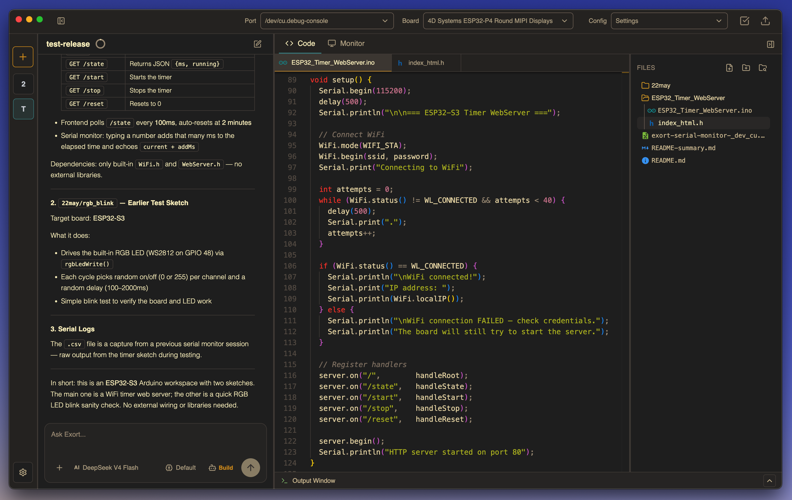
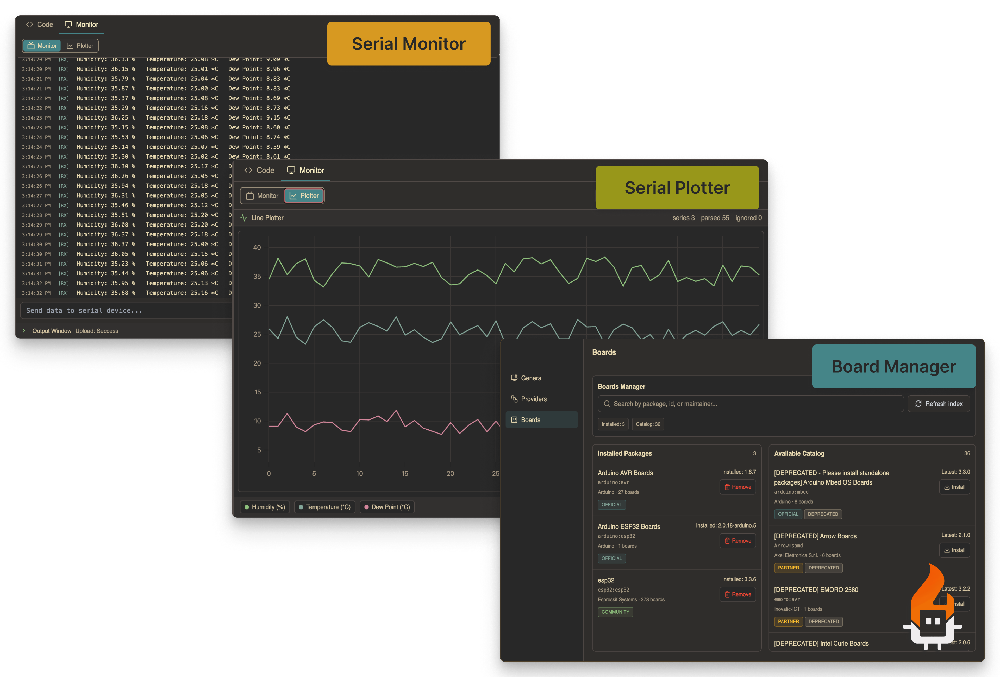

# Exort

Local-first desktop AI workspace for embedded development.

Exort brings the workflow for Arduino and embedded projects into one desktop app: AI-assisted coding, a real editor, board and port controls, compile/upload flows, serial output, and plotting.

- Local-first: the agent runtime runs on your machine, not through an Exort backend
- Desktop-only: Electron app built for an integrated embedded workflow
- Embedded-focused: code, boards, serial output, and debugging in one place



## Highlights

- AI chat and code editing in the same workspace
- Monaco editor with project file tree and tabbed editing
- Arduino compile and upload flows from the app
- Board manager for installing and managing cores
- Built-in Serial Monitor and Serial Plotter
- Workspace state and chat history persisted locally

## Core Features

Exort is built around the parts of embedded development that usually end up scattered across multiple tools.



### Serial Monitor

Watch live device output without leaving the app.

### Serial Plotter

Plot numeric serial data directly inside Exort while you iterate on firmware.

### Board Manager

Install and manage Arduino cores and related tooling from the desktop UI.

## Desktop-Only

This repository is intentionally desktop-only.

- `packages/desktop` contains the Electron + Svelte app
- Older backend, hosted auth, and quota flows are out of scope
- Native capabilities stay in the Electron main process and are exposed to the renderer through preload IPC

## Getting Started

### Prerequisites

- Node.js
- npm
- Desktop dependencies required by Electron on your OS

### Install

```bash
npm install
```

### Development

```bash
npm run dev
```

### Validation

```bash
npm run lint
npm run typecheck
npm run build
```


## Workflow

1. Open a workspace.
2. Ask Exort Agent to inspect the project or make a change.
3. Edit and review files in Monaco.
4. Select a board and serial port.
5. Compile or upload the active sketch.
6. Inspect output in Serial Monitor or Plotter.


## Architecture Notes

- The Exort Agent / OpenCode runtime is hosted in the Electron main process
- The renderer talks to native capabilities through `window.electronAPI`
- Workspace state, open files, and chat history are persisted locally
- Logs stay in the terminal rather than an in-app log console


## License
Exort is licensed under `AGPL-3.0-only`. See [LICENSE](LICENSE).
